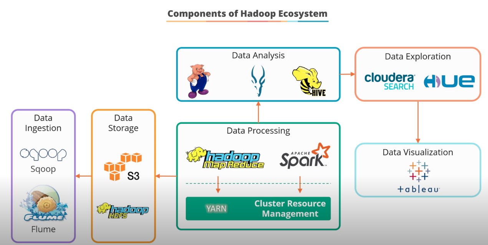
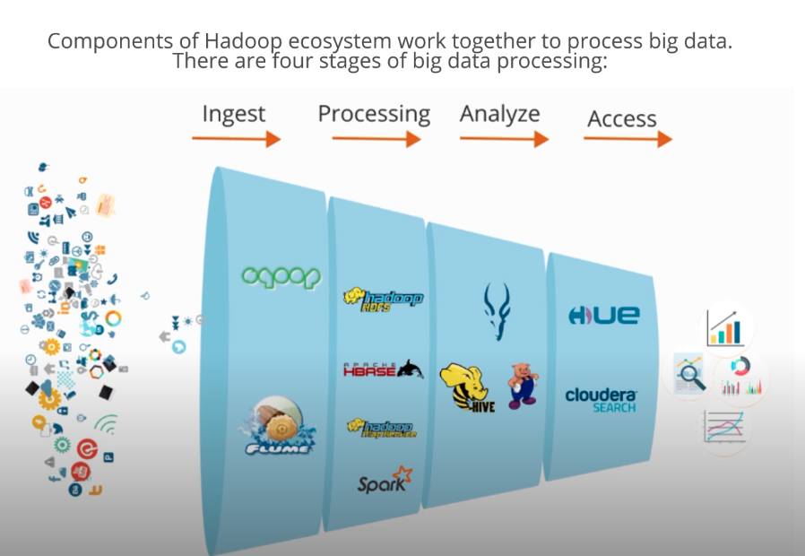

## Hadoop Introduction ##

1. Components of Hadoop comprises of these:

2. Data processing using Hadoop components will leverage these components in the following way:

3. The following are the functions of each of the Hadoop components:
### Data Ingestion ###
- Sqoop

- Flume

### Data Processing ###
- HDFS

- Hadoop Map-Reduce

- HBase

- Spark

### Data Analysis ###
- Hive

- Pig

- Impala

### Data Serving / Access ###
- Hue

---

## References
**Public datasets for our testing use**  
  

---

