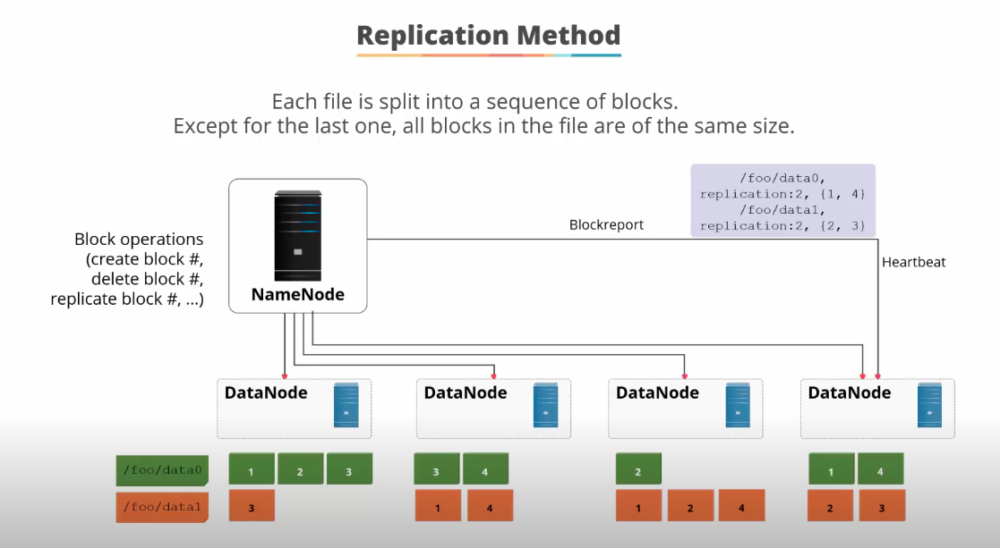

## HDFS - Hadoop File System ##

This section will dive deeper into Hadoop File System (HDFS).

1. What is HDFS?

2. Why do we need HDFS and its comparison with conventioonal file systems:

3. How does HFDS stores the files?

4. These are some of the characteristics of HDFS, making it cost effective for processing big data sets:

5. HDFS should always be setup in HA mode and this shows how it is done:

- It uses a master-slave architecture pattern
- Two or more machines are designated as `namenodes` but only 1 of them is active at any point in time
- The active `namenode` acts as the master and is responsible for all client operations withi the cluster; the standby `namenodes` are thus slaves in standby mode
- The active `namenode` and the secondary `namenodes` keep in sync with each other through shared, edit logs (metadata)
- The active `namenode` updates the edit logs when it is performing any operations; the standby `namenodes` reads the edit logs and applies the changes to its own namespace in a consistent manner
- In the event of a failover, the standby `namenode` ensures it has read all the edit logs before promoting itself to the primary `namenode`
- The failover can be manually performned by an admin or by using Zookeeper to make this automatic
- Zookeeper uses its own controller ZKFC (ZooKeeper Failover Controller) with constantly keeps an open session with the active `namenode` by periodically pinging it, with a health check command. If the node is frozen or inresponsive, the ZKFC will mark it as unhealthy and elect another `namenode` to be the active node
- The Zookeeper knows which one to elect, because a standby `namenode` will acquire an exclusive lock with the Zookeeper, indicating it should be the active `namenode`.

6. Two major HA implementations for storing metadata:

**Quorum-based storage mode**
- In the quorum-based storage mode, a QJM (quorum journal manager) maintains the eidt logs across a set of journal nodes; each time a client operation is performed by the active `namenode`, the changes are written to a majority of these journal nodes.
- In the event of a failure, the standby `namenode` will ensure it reads from all the journal nodes, apply all the changes to its namespaces before promoting itself as the active node.  

**NFS storage mode**
- The state is simply stored in a shared directory on a NFS and the standby `namenode` will read it from the shared directory in the event of a failure.
---

### HDFS Components ###

**Namenode Component**

- A core component of the HDFS cluster and single point of failiure.
- A `namenode` maintains and executes all filesystem name space operations such as, opening, closing and renaming of files and directories in HDFS.
- Namenode also determines the linking of blocks to data nodes.
- Namenode maintains 2 persistent files: **Edit Log** and **FsImage** (Filesystem image)  
  
-- **Edit Log** is a transaction log that records all changes in metadata, such as creating a new file; it is stored in the local filesystem of the `namenode`;
-- The **FsImage** contains the file properties, mapping of blocks & files; it is also stored in the `namenode` local filesystem;
-- When a `namenode` starts up, it reads the **Edit Log** and loads the **FsImage** and then updates the image with edit log information, then saves a snapshot of the updated image as a checkpoint, in its local filesystem.
-- **IMPORTANT** the metadata size is limted to the RAM available on the `naemenode`; hence HDFS prefers small num of large files than large num of small files, as the latter will deplete the memory of the `namenode` which will lead to a crash, rendering the HDFS system unavailable.

**Datanode Component**  

- Multiple instances of datanode exists and can be any number of datanodes, depending on the type of network and storage system.
- Data node servers stores and maintains the data blocks associated with it.
- Data node also retrieves the data blocks when asked by clients or the `namenode`.
- It performs the actual read and write requests of the data blocks, performs deletion and replication on instruction from the `namenode`.
- Data nodes manage names and locations of the file/data blocks.

**Data Block Split**  

- This an important process of HDFS architecture.
- Each file is split into different data blocks, stored and replicated across data nodes.
- Each file block is default 128MB.
- All file blocks are of the same size except for the last one.
- Each file block is replicated across different data nodes, e.g. _0, _1 etc, according to the replication factor (default 3) at the cluster level setting; this can be changed at the file level.
- Each task operate on one block and if the num of tasks is < the num of data nodes in the cluster, the job will run slowly. Hence if the file blocks are smaller than 128MB, this can potentially lead to slow operations.
- The Job Tracker service present on the `namenode` will keep track of gaps in the data nodes and submit the job to the right data node where the data block exists.

- Each data node reports its heart beat to the `namenode` to make sure it is functioning and also provides a **Blockreport** of where each block and its replicas are located on the data node.
- The data replication topology is as follows:  
  
-- The default replication is 3;  
-- Place the 1st replica on the same data node of of the client program operating on it, from the same physical rack;  
-- Place the 2nd replica on a different rack from the 1st replica;  
-- Place the 3rd replica on the same rack as replica#2 but on a differenr data node;  
-- This topology ensures high accessibility and fault tolerance.

**Zookeeper Component**
- The ZK functions are failure detection and then active `namenode` election:

- ZK allows distributed processes to coordinate with each other.
- The ZK service is backed by a series of servers, which maintain an in-memory image of state, along with transaction logs and snapshots in a persistent store.
- There is always a leader amongst the servers which is backing the ZK service.
- As long as majority of the servers are available, the ZK service will be available.

**HDFS Details**  
1. HDFS Filesytem Namespace - How files are organised in HDFS
- All data are stored as files.
- Organised like a regular OS filesystem, with directories and files.
- The `namenode` is responsible for maintaining this filesystem namespace (i.e. the way things are organised) and supports operations for create, remove, move and rename, as well as recording any changes meta information. 

2. HDFS can be access via these 4 methods:  

3. HDFS common command line operations:  

---

