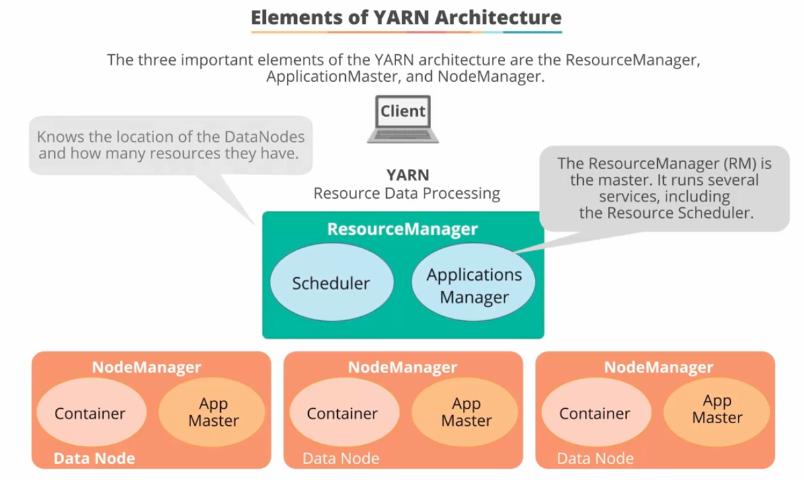
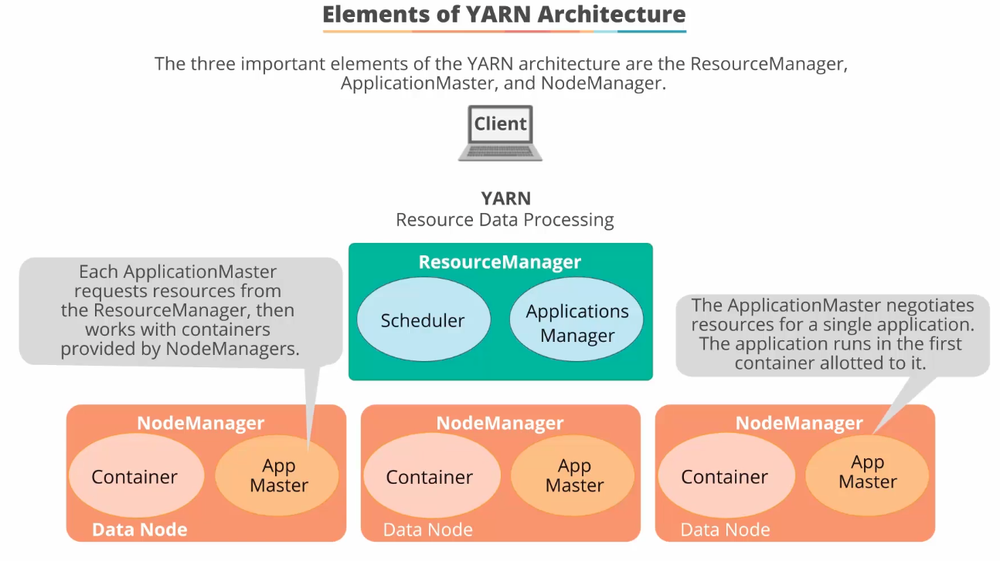
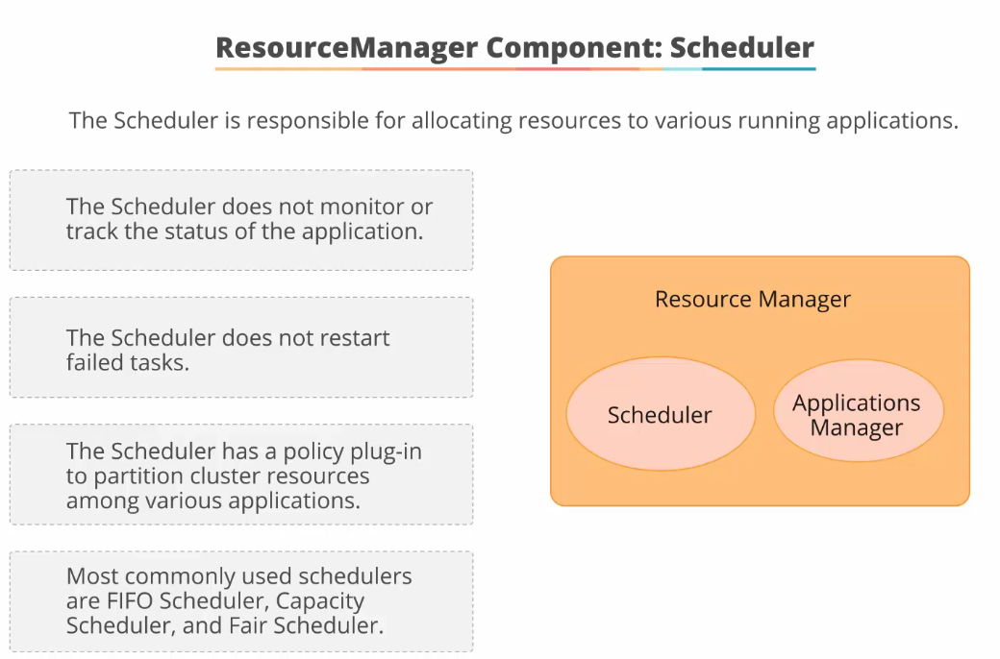
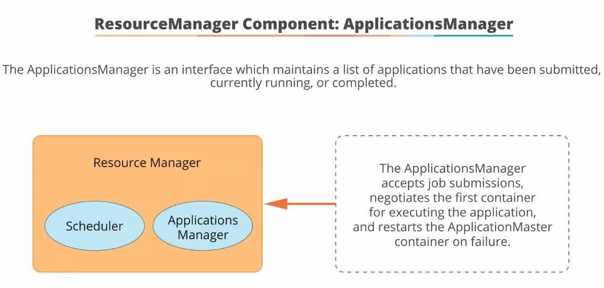
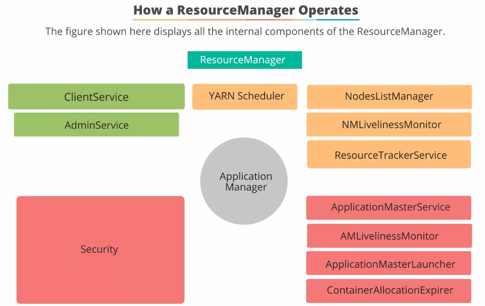
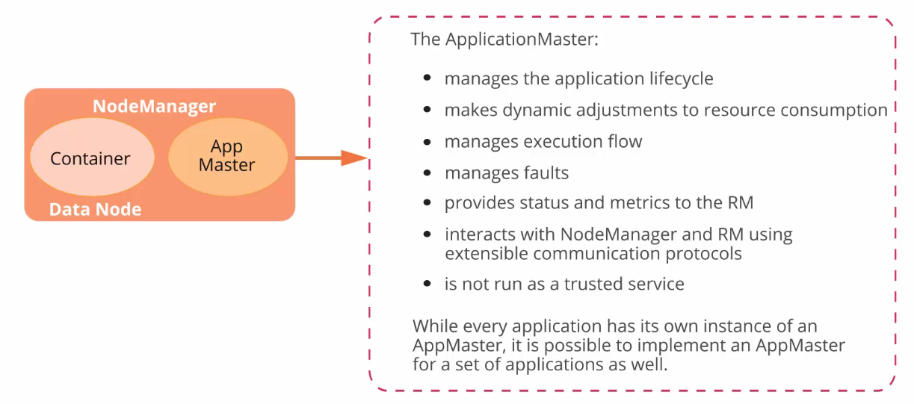
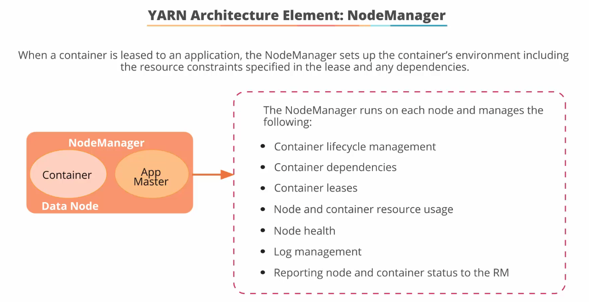
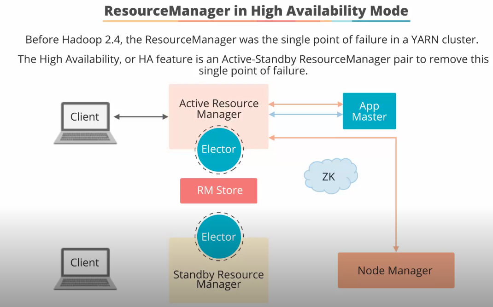

## YARN - Yet Another Resource Negotiator ##

This section will dive deeper into YARN.

### 1. What is YARN?
- Since Hadoop 2.0;
- Separates resource management and job monitoring into different daemons;
- Manages Hadoop workload, HA features and security controls;
- YARN enabled MapReduce processing to scale and also allowed other framework such as Spark to be leverage Hadoop.

### 2. Elements of YARN
- The most important elements of YARN include `ResourceManager`, `NodeManager`, `ApplicationMaster`. Their roles are:
  

### 3. ResourceManager services:
- RM has the `YARN Scheduler` and `ApplicationsManager` services;
- `YARN Scheduler` i s responsible for allocating resources to the various running applications and its roles are:  

- `ApplicationsManager` is an interface which maintains a list of applications that have been submitted, currently running or completed. Its roles are:  

**3.1 How ResourceManager operates:**
- The RM operations can be summarised using this diagram:  

- `ClientService` communicates with the RM for submitting or terminating an application, getting info about scheduling queue;
- `AdminService` provides info to users about the cluster operatuons;
- `ResourceTrackerServce` receives node heartbeats from node managers to track lifecycle of nodes;
- `NMLivenessMonitor` and `NodeListManager` collaborate to keep track of status of nodes (healthy or not), so that work can be allocated accordingly;
- `ApplicationMasterService` keeps track of all the app masters across all the nodes;
`AMLivelinessMonitor` keeps track of a list of app masters and their last heartbeat times, so that the RM which applications are healthy; an application master that does not send its heartbeat after x interval to the RM, it is marked as 'dead' and will be rescheduled to run in a new container;
- Users submit applications to the `ResourceManager` by using the **hadoop jar command**;
- The `ResourceManager` maintains a list of applications on the cluster and available resources on each `NodeManager`;
- It determines the next application to receive the cluster resources using constraints on queue capacity, ACL and fairness policy;
- Once an application is accepted, RM uses `YARN Scheduler` to select a container and RM starts the `ApplicationMaster` in this container.

### 4. ApplicationMaster service  
  
- The `ApplicationMaster` is executed in its own container and is being looked after by the `ResourceManager`;
- The `ApplicationMaster` once started, sends resource request back to `ResourceManager` to ask for containers (via `YARN Scheduler`) to run the application tasks, by specifying the RAM and CPU shares needed and also the preferred rack/host the application needs to run on; the RM allocates a container ID for the allocated container along with a hostname back to the `ApplicationMaster`;
- After a container for the application is allocated, AM contacts the local `NodeManager` to launch the application by setting up the runtime environment for the container;
- The `ApplicationMaster` is responsible for a single application & their tasks execution, restarts failed tasks in newly requested containers and reports progress back to the client that submitted the application;
- The `ApplicationMaster` knows the application logic and is thus framework specific, e.g. Spark;
- You can also write your own framework and provide your own `ApplicationMaster` to extend it communications with the RM and NodeManager(s); hence the `ApplicationMaster` is not a trusted service within YARN.

### 5. NodeManager service  
  
- When a container is leased to an application, the `NodeManager` sets up the container's environment including the resource constraints specified in the lease and any dependencies;
- The `NodeManager` does not monitor the tasks and their status that are run in the container(s) on the same host/rack; it simply monitors the **resources usage** consumed by the container(s).

### 6. RM in HA mode  

- `ResourceManager` is the single point of failure in YARN;
- HA is achieved by adopting an active-standby architecture for the `ResourceManager`;
- Trigger to failover comes from the `AdminService` or  from a failover controller such as Zookeeper.

### 7. Tools for developers to interact with YARN
7.1 YARM Web UI
- runs on port 8080 by default;
- provides better UI than HUE Job Browser but you cannot control or configure jobs from it;

7.2 HUE Job Browser
- Monitor status of job, kill a running job or view logs;  

7.3 YARN 
- Used mainly by admin than developers;
- Viewing logs is most commonly used: `yarn logs -applicationId <app-id>`
---