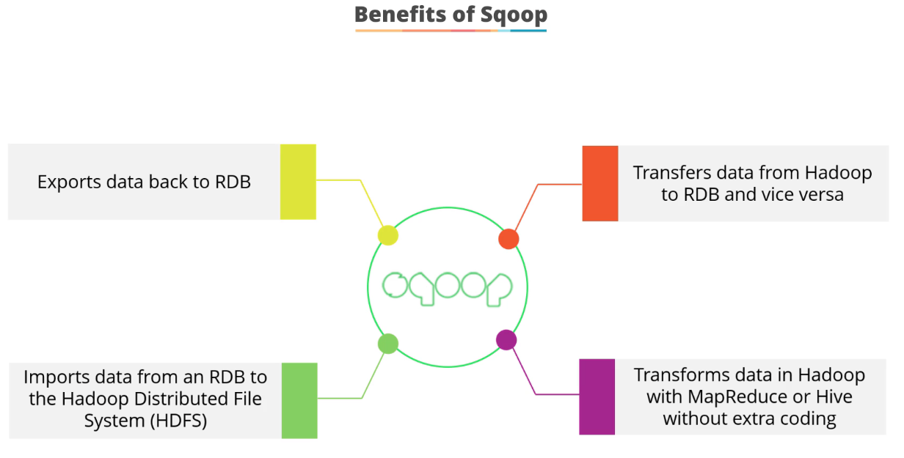
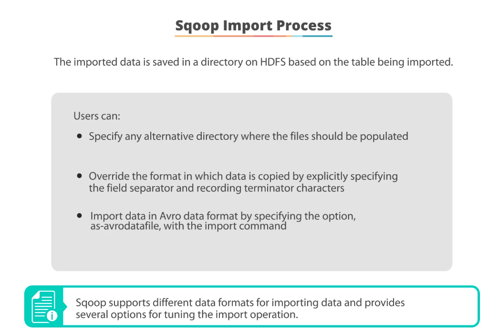
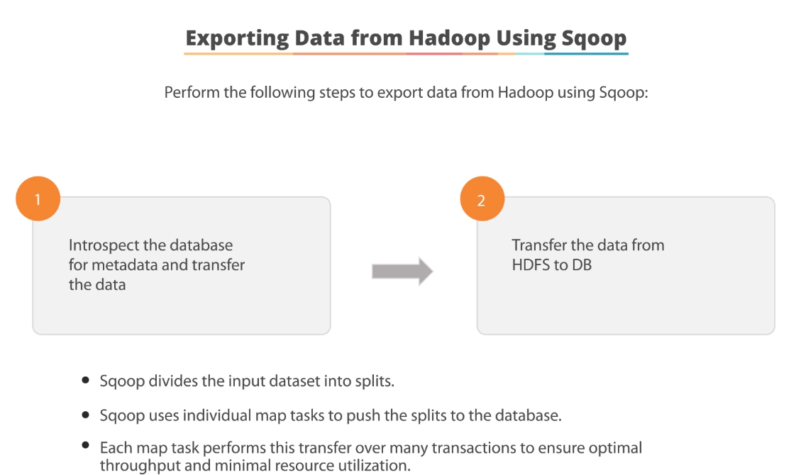
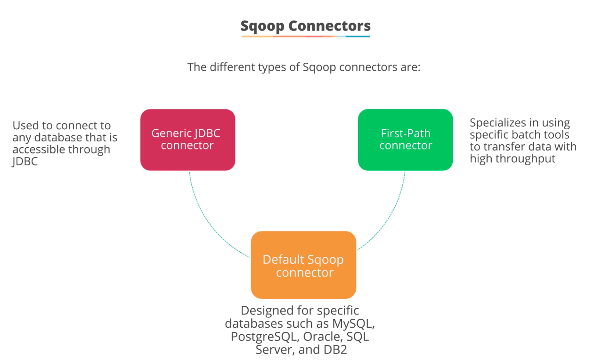
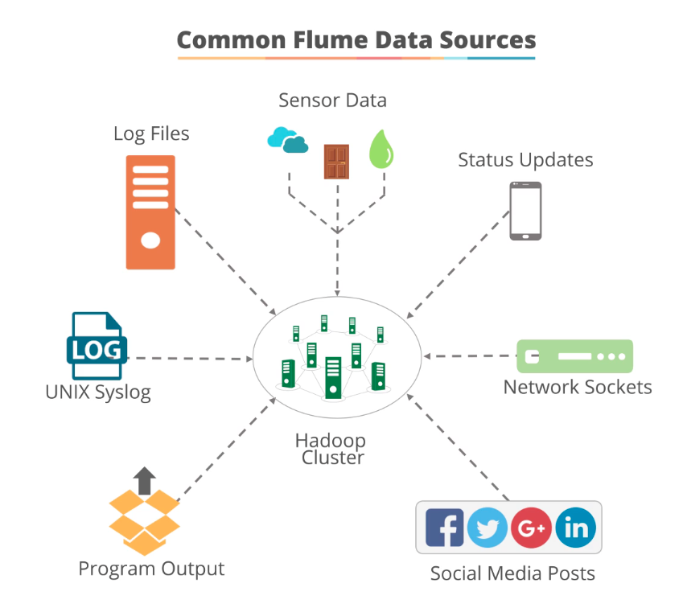
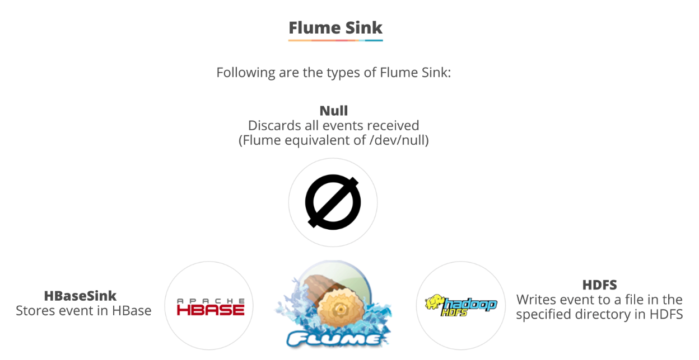
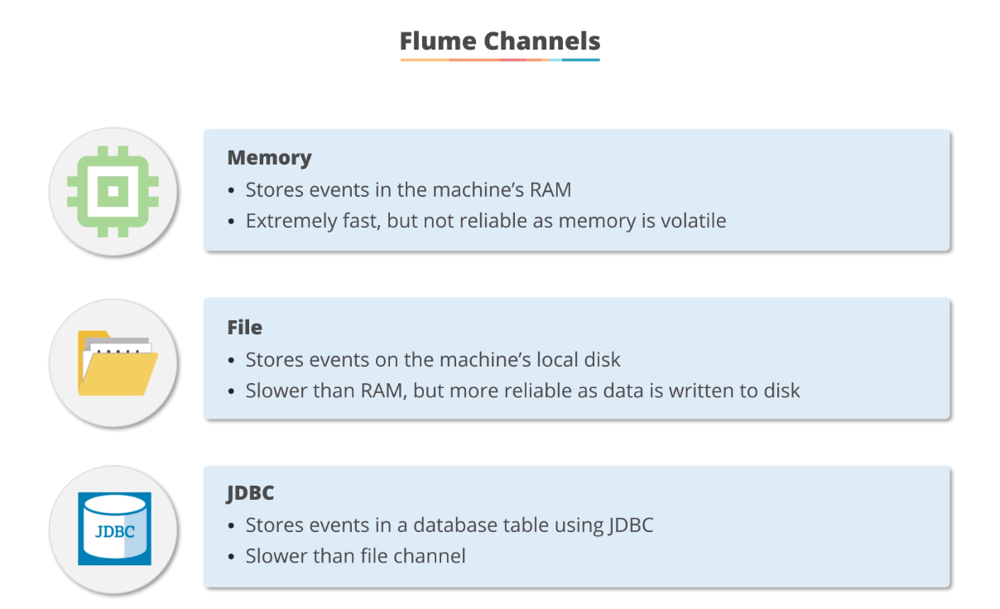
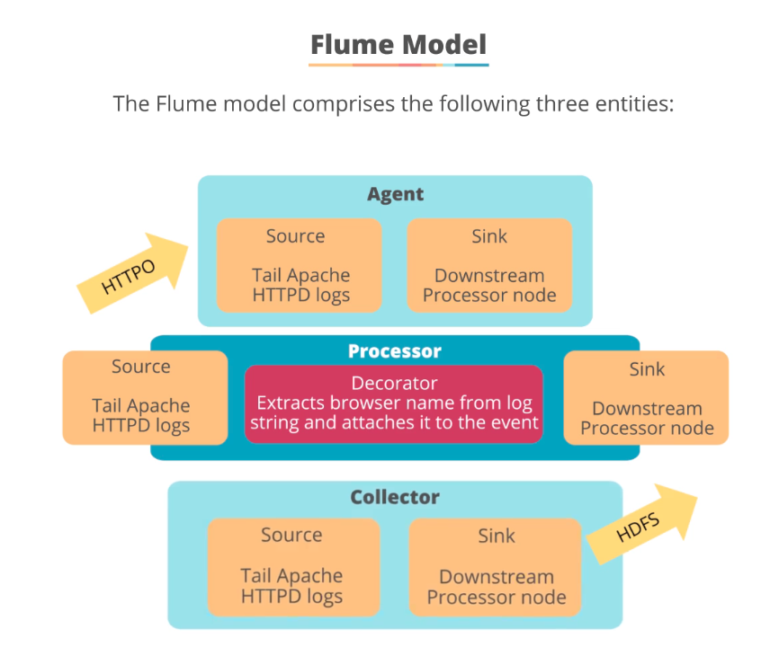

## Data Ingestion in Hadoop ##

This section will dive deeper into YARN.

### 1. Apache Sqoop?
- CLI interface for transferring RDBMS data and Hadoop;
- Supports incremental loads of single table or free-form SQL;
- Used to populate Hive or HBase;
- Used to export Hadoop data into RDBMS;
- Solves the concerns of bulk imports from RDBMS into Hadoop for MapReduce jobs and the consistency that needs to be maintained;
- Works alongside Oozie as the workflow engine to automate import and export tasks; 
- Can also transform data using MapReduce or Hive without coding; 

- Benefits of using sqoop:  

- Sqoop import database records into files, with fields comma-delimited with newline as the records termination char by default;
- The summary of the import process is as follows:  

- The summary of the export process is as follows:  

- There ar 3 types of sqoop connectors we can use:

-However sqoop has its limitations and are summarized as follows:

### 2. Apache Flume
- A distributed and reliable service for importing data into HDFS or HBase from streaming data sources, e.g. log data; can be used for unstructured data as opposed to sqoop;
- Contains 3 components: **Source**, **Sink** and **Channel**;
- Developers can write their own sources or sinks to match their own environment;
- Flume supports these different sources out-of-the-box:  
  
- Flume supports 3 types of sinks out-of-the-box:  
  
- Flume supports 3 types of channels out-of-the-box:  
  
- Very useful for scenarios such as aggregrating all the logs across a cluster of servers and they need to be analyzed together;
- Flume model comprises of 3 entities:  
  
-- Agent resides with the source systems and ensures a continuous stream of data is ingested; the source, sink and channel components are configured within an agent that governs which source the data will come from and which sink it will go to (HDFS or HBase or nothing);  
-- Processor performs the intermediate processing of the ingested data;  
-- Collector writes to the data to HDFS;  

### 3. Apache Kafka
- ??.
--- 