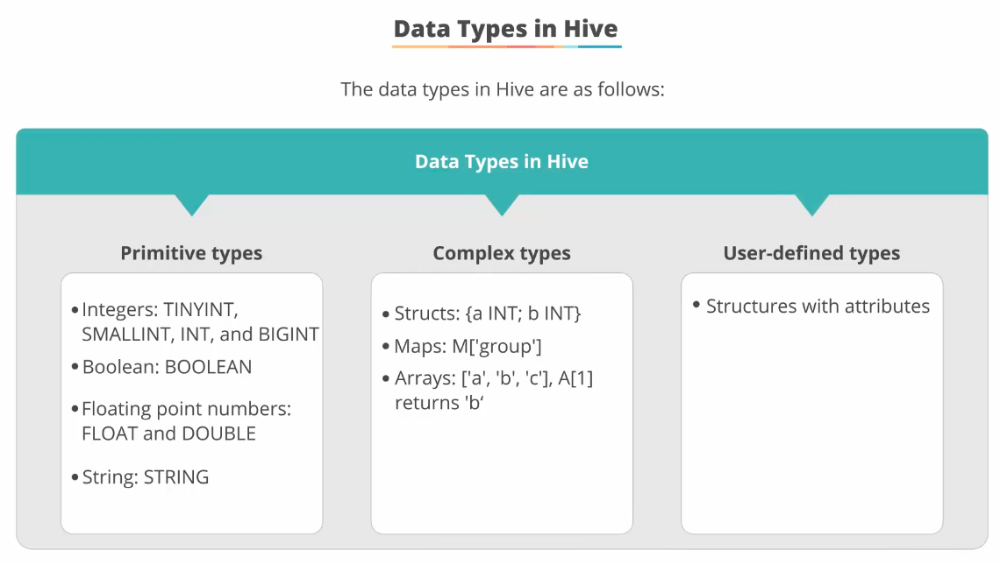

## Apache Hive ##

This section will dive deeper into Apache Hive.

### What is Hive?
- Provides SQL like interface for users to extract data from the underlying Hadoop system [HDFS, HBase];
- Like Presto but limited to Hadoop backend only;  

- Hive cannot delete individual records as compared to our regular RDBMS;

### Features of Hive

### Hive Architecture
  
**Hadoop core components**
- Mainly MapReduce and HDFS; Hive internally stores data in an HDFS path while query against Hive are converted into Java class file to execute MapReduce jobs;  
**Metastore**
- Stores meta info for Hive, such as details related to the table such as columns, partitions and location on storage;  
**Drivers**
- Execution of queries are translated and managed by drivers;  
**Hive clients**  
- CLI, Hive Web UI are some of interfaces a user can use to interact with Hive.

### Hive Execution Flow
  

### Interfaces to run Hive queries
- Hive Query Editor web UI, via Hue browser
- Beeline CLI, e.g. `beeline -u ... --f some.hql`
- ODBC / JDBC

### Hive metastore
- Uses of metastore is as follows:  
   
-- A table in Hive is simply an HDFS directory containing zero or more files; **default** HDFS path is `/user/hive/warehouse/<table_name>`  
-- Since it's a directory, a Hive table can support many formats for data storage and retrieval;  
-- Metastore contains metadata such as tables, columns and partitions;  
-- Hive uses metastore to get table structure and location of data;  
-- Uses Java-based Derby DB to store the metadata by default; but any database that supports JDBC can be used as the metastore.
- Overview of how Hive stores the data:  
  
 - Data types in Hive:  
    
- Data Validation in Hive  
-- Also Hive is "schema on read" which does not validate data on insert;  
-- Errors in file formats are only discovered when queries are performed against the data and not when they are loaded into tables and HDFS;  
-- Missing data will be represented internally as `null`;

### File format types in Hive:    
    
**Text file format**
- Most basic and versatile as any programming language can process it;
- Delimited by comma or tab;
- Consumes more space as numeric has to be stored as string;
- Difficult to represent binary data.

**Sequence file format**
- key-value pairs in binary format and hence more efficient storage;
- Not human readable.

**Avro file format**
- Efficient in storage;
- Widely supported inside and outside the Hadoop ecosystem;
- Ideal for long term storage od data;
- Supported by many programming languages to read/write Avro format;
- Embeds the schema metadata in the file to ensure it will always be readable; schema evolves with the file;
- Considered to be the best choice general purpose storage in Hadoop;
- When we create a Hive table, the corresponding Avro schema is also created.

**Parquet file format**
- Columnar format developed by Cloudera and Twitter;
- Schema metadata can be be embedded within the file;
- Implements the storage optimisation in Google's Dremel paper and hence reduces storage sizes;
- Considered most efficient for adding multiple records at a time;
- We can also explicitly instruct Hive tables creation to use Parquet format by specifying in the CLI parameter during creation;
- Use `parquet-tools` to read parquet format files.

### Data Serialization    
- Leverages Avro as the data serialization framework, which is considered to be most efficient framework, supports RPCs; 
- Basic data types supported:   
    
- Complex data types supported:   
  

### Hive Optimization (Partitioning, Bucketing & Sampling)    
- Partitioning is key as this reduces Hive query time significantly;  
-- subdirectories are created for each unique value of a partitioned column;
- When a Hive table is NOT partitioned, all queries have to scan all files in a directory, which means I/O for reading all the files --> very inefficient, esp when the tables are large;
- Partitions are horizontal slices of data that allow larger sets of data to be separated into nore manageable chunks;
- So partitions allow us to store in separate files by the partitioned column;
- So for example, if we have data containing a `nationality` for a pool of customers, the number of unique state values will determine the number of partitions of the data by `nationality`.  

**Static Partitioning**
- Manually created and defined using the `ADD PARTITION` clause on the fly, hence load data files individually into a partitioned table;
- When loading data into the Hive table, you need to specify which partition to store the data in by specifiying the partitioned column value;
- You can manually add new partitions and move the files into the partition table.

**Dynamic Partitioning**
- Created automatically at load times;
- New partitions can be created dynamically from existing data;
- Suitable when there is a large amount of data stored in a table.
- Dynamic partitioning is **disabled** in Hive by default to prevent accidental partition creation;

**When to use partitioning?**  
   

**When NOT TO use partitioning?**  
   

### Bucketing in Hive    
- When over partitioning has become a problem;
- An optimisation technique that can be used too when you want to query a column with large num of data;
- Taking similar looking column values and then grouping them together into buckets so that their query can be more efficient, e.g. bucketing zip codes starting with 12xxxx;
- What does a bucket do?  
   

### HiveQL overview    
- HiveQL is SQL like language;
- HiveQL is designed to be extended through pluggable UDFs, pluggable MapReduce scripts, pluggable user defined types & pluggable data formats;

**User Defined Functions (UDFs)**
- UDFs are written in Java;
- Evaluated in HiveQL statements;
- Leverage the built-in functions in Hive to help out rather than writing everything from scratch:  
   
- There are also more advanced aggregation and table generating functions provided by Hive and below is an example:  
   
--- 