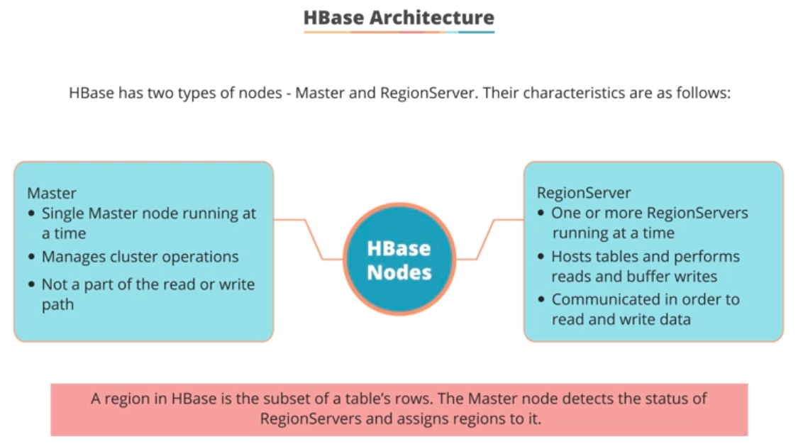
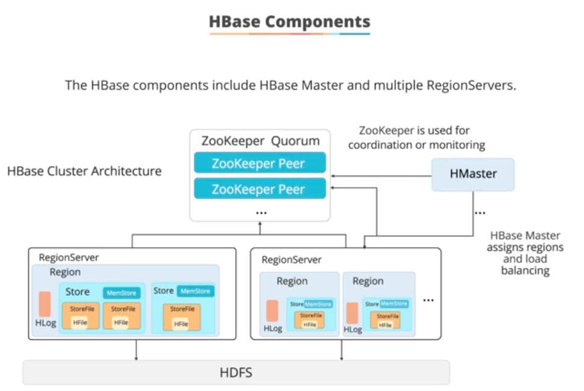
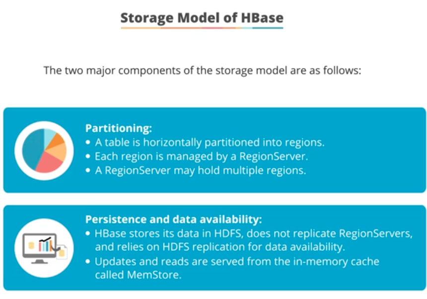
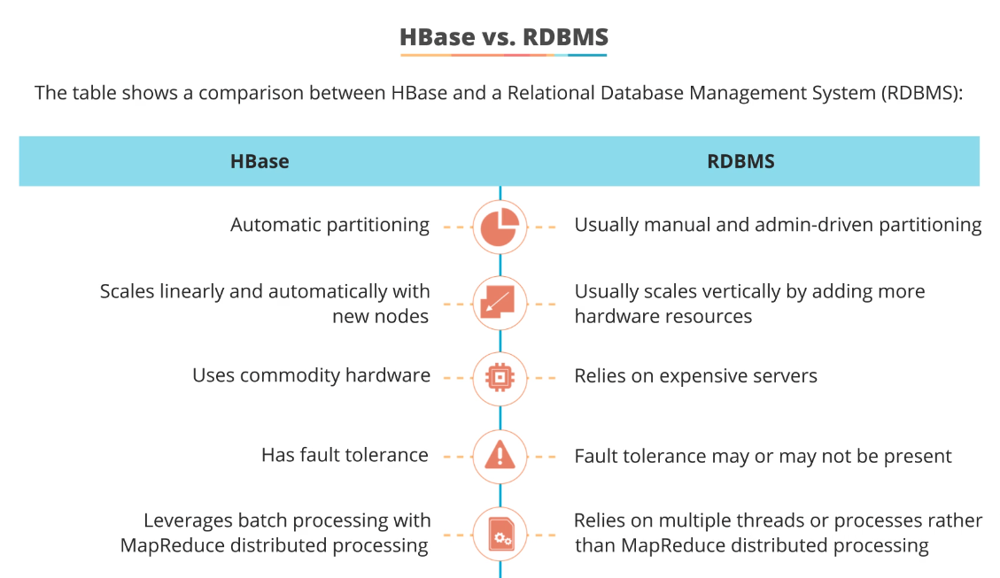
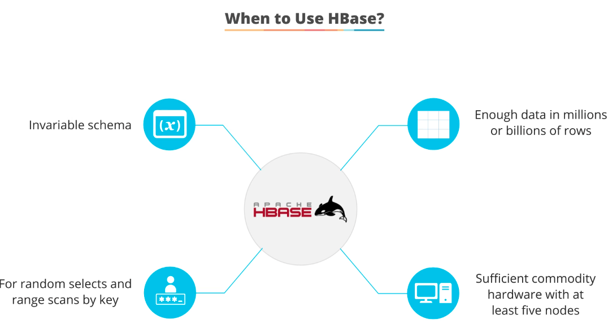

## Apache HBase ##

This section will dive deeper into Apache HBase.

### What is HBase?
- A key-value & column-based NoSQL database; designed by Powerset in 2007;
- Enables real time analytics of data on top of HDFS;
- Can store huge amount of data in tabular format for fast read/write;
- Mostly used in write scenarios needing inserts and overwriting of data;
- HBase provides a sort BigTable capability on top of HDFS, without worrying about the underlying sequence of data being processed;
- [FYI] NoSQL databases has 4 main types: Key-Value pair DB (Redis), Document DB (MongoDB, CouchDB etc), Column-based DB (Cassandra, HBase, BigTable etc) and Graph DB (Neo4j, Infinite Graph etc);

### HBase Architecture
- HBase has 2 types of nodes: Master and RegionServer:  

- HBase components interact as follows:  

- RegionServers act like availability zones and is always in sync with the Master, via the Zookeeper service;
- The major components of HBase are partitioning and data availability:  

- Data are stored in files called HFiles or StoreFiles and saved in HDFS; HFiles are key-value map;
- When data is added, it it written to log called Write Ahead Log and then stored into MemStore; like Kafka- HBase does not support update to an existing file;
- HBase stores each row using a unique rowKey (with versioning), and each rowKey points to a column family, which can contain any num of columns; this allows us to continuously expand as many columns we need;

### HBase vs RDBMS
- Compared to RDMS:  

- When to use HBase:  

--- 